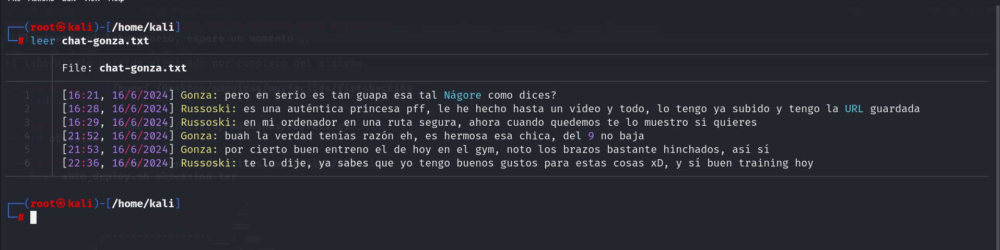
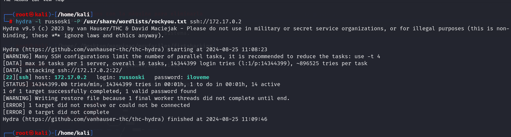

**Empezamos con un escaneó de puertos**

**Vemos que podemos comentarnos por ftp con el usuario anonymous sin contraseña**

**Descargamos ambos txt**

**Hacemos fuerza bruta con hydra al usuario russoski**

**Nos conectamos por ssh al usuario russoski contraseña iloveme**

**Vemos dos formas de elevar prilegios**

**Somos root de dos maneras diferentes**
